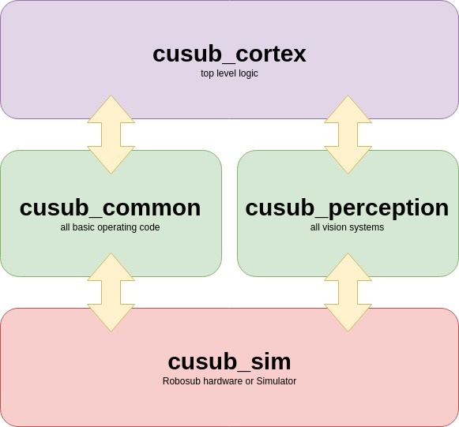

.. CU_RoboSub documentation master file, created by
   sphinx-quickstart on Sat Feb  2 19:51:43 2019.
   You can adapt this file completely to your liking, but it should at least
   contain the root `toctree` directive.

Welcome to CU RoboSub's software documentation!
======================================

.. toctree::
   :maxdepth: 2
   :caption: Contents:

Indices and tables
==================

* :ref:`genindex`
* :ref:`modindex`
* :ref:`search`
